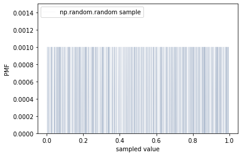
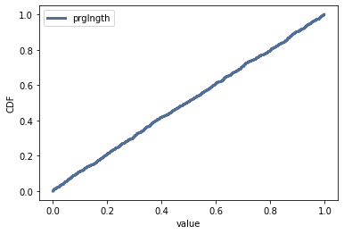

[Think Stats Chapter 4 Exercise 2](http://greenteapress.com/thinkstats2/html/thinkstats2005.html#toc41) (a random distribution)

> The numbers generated by numpy.random.random are supposed to be uniform between 0 and 1; that is, every value in the range should have the same probability.

> Generate 1000 numbers from numpy.random.random and plot their PMF. What goes wrong?

> Now plot the CDF. Is the distribution uniform?

```python
rand = np.random.random(1000)
rand_pmf = thinkstats2.Pmf(rand, label="np.random.random sample")
thinkplot.Pmf(rand_pmf, linewidth=0.05)
thinkplot.Config(ylim=(0,0.0015),xlabel=" value", ylabel="PMF")
```



We see that since the values are continuous, we just get that the PMF is 0.001 at any value that was sampled, and 0 elsewhere. (The values are too densely clustered to see the 0s.)

```python
cdf = thinkstats2.Cdf(rand, label='prglngth')
thinkplot.Cdf(cdf)
thinkplot.Config(xlabel="value", ylabel="CDF")
```



We see that the distribution is uniform as expected.