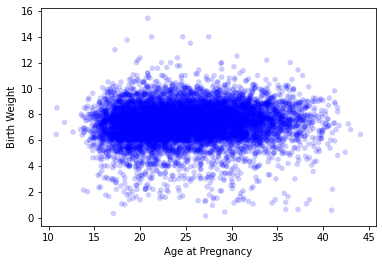

[Think Stats Chapter 7 Exercise 1](http://greenteapress.com/thinkstats2/html/thinkstats2008.html#toc70) (weight vs. age)

> Using data from the NSFG, make a scatter plot of birth weight versus mother’s age. Plot percentiles of birth weight versus mother’s age. Compute Pearson’s and Spearman’s correlations. How would you characterize the relationship between these variables?

```python
thinkplot.Scatter(live.agepreg, live.totalwgt_lb, alpha=0.2)
thinkplot.Config(xlabel='Age at Pregnancy',
                 ylabel='Birth Weight')
live.agepreg.corr(live.totalwgt_lb, method="pearson"), live.agepreg.corr(live.totalwgt_lb, method="spearman")
> (0.0688339703541091, 0.09461004109658226)
```



We see a weak positive correlation between the two variables. The fact that the Spearman's correlation is different (and larger) suggests the presence of outliers or non-linearity, given that Pearson's correlation has issues dealing with outliers and underestimates non-linear relationships. 